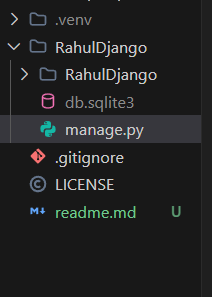
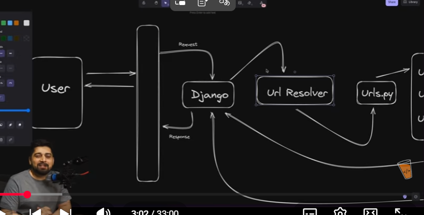
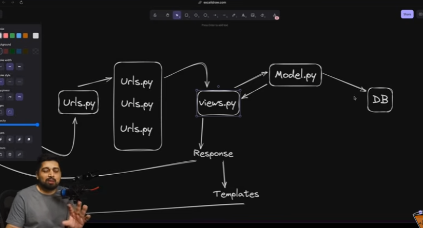
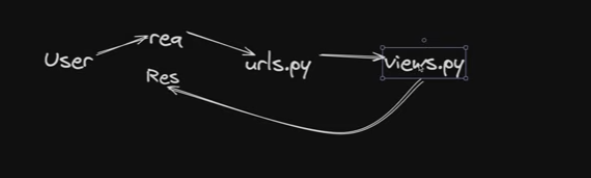

# Django 
- we will start with virtual environment
- installed uv package `pip install uv`
- created virtual environment `uv venv`
- activated virtual environment `venv\Scripts\activate`
- installed Django `uv pip install Django`
- checked Django version `uv pip show Django`
- initialization of django project `django-admin startproject myproject`
- Running the project `python manage.py runserver`
- for changing port `python manage.py runserver 8001`
- after opening the localhost in browser we will see the django welcome page because debuging is true by default
-  `contains project level and file level`
- pychache folder is created when we run the project due to multiple modules
-  
- 

### working with views
- views.py is the file where we write the logic of our application
- urls.py is the file where we map the URLs to the views
- 

### used render 
- created templates folder in the project directory
- created home.html file in the templates folder
- than have to import render in views.py file
- than use render(request,'home.html') in views.py file

### used templates
- created templates folder in the project directory
- created index.html file in the templates folder
- changed settings.py file to include templates folder in dir list
- than have to import render in views.py file
- than use render(request,'website/index.html') in views.py file

### used static files
- created static folder in the project directory
- created style.css file in the static folder
- used  in index.html file
- for stylesheet path i used 
- than import os in settings.py file
- than set STATICFILES_DIRS = [os.path.join(BASE_DIR, 'static'),] in settings.py file just below previous static setting
- than have to import load static in views.py file
- than use render(request,'home.html') in views.py file

`13-02-2026`

